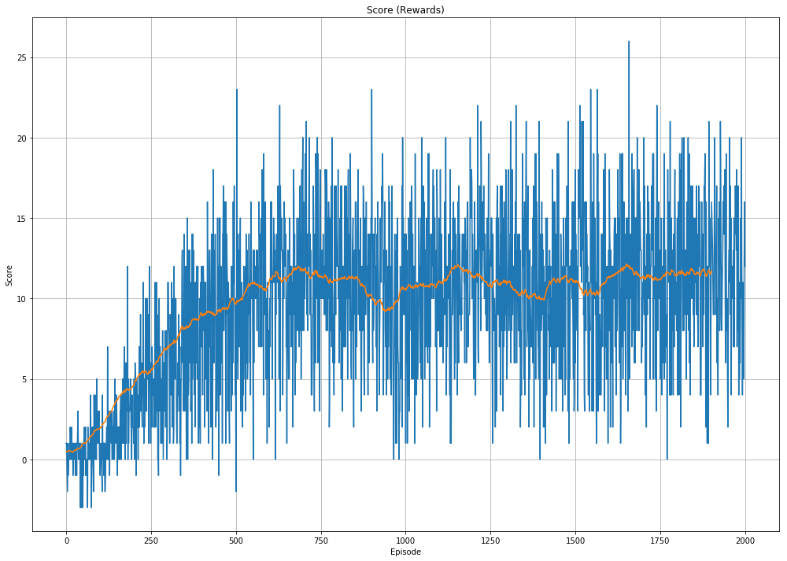

# Deep Reinforcement learning Banana Navigation

A reward of +1 is provided for collecting a yellow banana, and a reward of -1 is provided for collecting a blue banana. Thus, the goal of the agent is to navigate throught the environment and collect as many yellow bananas as possible while avoiding blue bananas.


```
Unity brain name: BananaBrain
        Number of Visual Observations (per agent): 0
        Vector Observation space type: continuous
        Vector Observation space size (per agent): 37
        Number of stacked Vector Observation: 1
        Vector Action space type: discrete
        Vector Action space size (per agent): 4
        Vector Action descriptions: , , , 
```
The state space has 37 dimensions and contains the agent's velocity, along with ray-based perception of objects around the agent's forward direction. Given this information, the agent has to learn how to best select actions. Four discrete actions are available, corresponding to:
- 0 - move forward.
- 1 - move backward.
- 2 - turn left.
- 3 - turn right.


## InstallEnvironment
Download and unzip files to match the path in ```env = UnityEnvironment(file_name="Banana_Linux/Banana.x86_64")```
- Linux: [click here](https://s3-us-west-1.amazonaws.com/udacity-drlnd/P1/Banana/Banana_Linux.zip)
- Mac OSX: [click here](https://s3-us-west-1.amazonaws.com/udacity-drlnd/P1/Banana/Banana.app.zip)
- Windows (32-bit): [click here](https://s3-us-west-1.amazonaws.com/udacity-drlnd/P1/Banana/Banana_Windows_x86.zip)
- Windows (64-bit): [click here](https://s3-us-west-1.amazonaws.com/udacity-drlnd/P1/Banana/Banana_Windows_x86_64.zip)


## Demo Video
[](https://www.youtube.com/watch?v=phS7am7zyZY)


## Test your Unity Environment setup
```
python test_environment_setup.py
```
if this script opens up the Unity Environment, then the setup is good to go.

## Training the agent
By Default the agent will be trained for 2000 episodes with a DQN Agent, hyperparameters can be changed in ```dqn_agent.py``` file and Double DQN can be used by using the agent in ```ddqn_agent.py``` . 
```
python train_agent.py
```
### DQN


### DDQN



## Trained Agent
The agent was trained on a Tesla K80 GPU for 2000 episodes and local development was done on GTX 1050 GPU.
```
python run_trained_agent.py
```