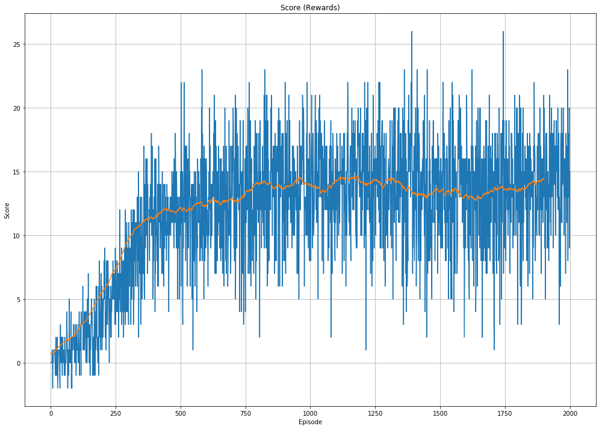

# Environment

A reward of +1 is provided for collecting a yellow banana, and a reward of -1 is provided for collecting a blue banana. Thus, the goal of the agent is to navigate throught the environment and collect as many yellow bananas as possible while avoiding blue bananas.


```
Unity brain name: BananaBrain
        Number of Visual Observations (per agent): 0
        Vector Observation space type: continuous
        Vector Observation space size (per agent): 37
        Number of stacked Vector Observation: 1
        Vector Action space type: discrete
        Vector Action space size (per agent): 4
        Vector Action descriptions: , , , 
```
The state space has 37 dimensions and contains the agent's velocity, along with ray-based perception of objects around the agent's forward direction. Given this information, the agent has to learn how to best select actions. Four discrete actions are available, corresponding to:
- 0 - move forward.
- 1 - move backward.
- 2 - turn left.
- 3 - turn right.


# Agent
DQN Agent was used to approximate the value function. DQN agents return the value of a state action pair with approximation from neural networks. DQn has experience replay which breaks order of experience and keeps track of buffer of (S(t), A(t), R(t+1), S(t+1)). Samples are sampled randomly from the buffer when the model is trained. Fixed Q targes make sure that the parameters are not shifted towards a moving target and id updated after every n episodes. DOuble DQN helps to avoid oversetimation of action.

```
class QNetwork(nn.Module):
    def __init__(self, state_size=37, action_size=4, seed=0):
        super(QNetwork, self).__init__()
        self.seed = torch.manual_seed(0)
        middle_size1 = 100
        middle_size2 = 100
        self.fc1 = nn.Linear(state_size, middle_size1)
        self.fc2 = nn.Linear(middle_size1, middle_size2)
        self.fc3 = nn.Linear(middle_size2, action_size)
        self.relu = nn.ReLU()

    def forward(self, state):
        x = self.fc1(state)
        x = self.relu(x)
        x = self.fc2(x)
        x = self.relu(x)
        x = self.fc3(x)
        return x
```


## Hyperparameters
- number of episodes = 2000
- maximum time steps = 5000
- Exploration eps_start=1.0, eps_end=0.01, eps_decay=0.995

- Buffer size = 1e5
- batch size = 100
- Gamma = 0.99
- TAU = 1e-3
- LR = 1e-3

# Training time
- DQN took 57.8 minutes for 2000 episodes
- DDQN took 52.8 minutes for 2000 episodes

DQN training rewards


## To-Do
- Pixel Agent to train from the frames
- Policy based methods
- Actor Critic method